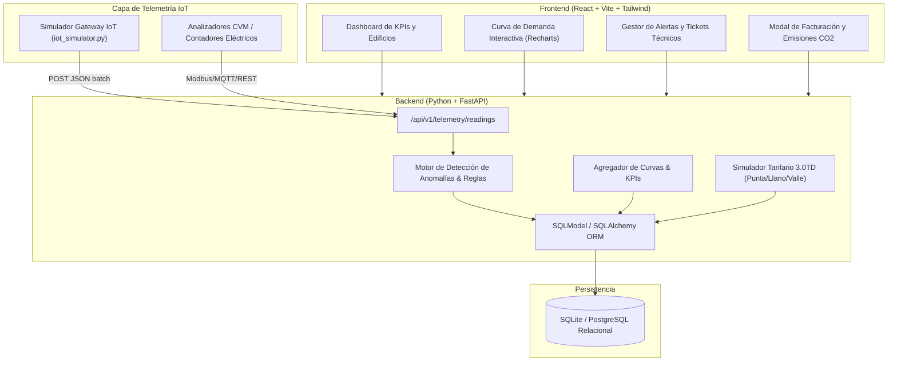

# SyncroHub - Smart Building & Energy Management Platform

[](specs/03-task-breakdown.md)
[](https://fastapi.tiangolo.com)
[](https://react.dev)
[](https://www.typescriptlang.org)
[-purple?style=flat-square)](specs/01-specification.md)
[](LICENSE)

> Prototipo funcional y demostración técnica desarrollado específicamente para el proceso de selección de **Desarrollador/a Full Stack en SyncroHub**. Implementa la arquitectura central para la gestión inteligente de edificios, telemetría IoT de contadores, motor de detección de anomalías energéticas, incidencias de mantenimiento y simulación de facturación eléctrica.

---

## Vista de la Plataforma

```
+----------------------------------------------------------------------------------------------------+
|  SyncroHub [Smart BMS]       [ Torre Castellana (Madrid) v ]  [ Test: Inyectar Pico IoT] [Swagger API] |
+----------------------------------------------------------------------------------------------------+
| [ POTENCIA ACTUAL ]          [ CONSUMO HOY ]             [ COSTE ESTIMADO ]       [ ESTADO TÉCNICO ]|
|  114.2 kW (63.4% carga)       1.420 kWh (-4.2% vs ayer)   218.40 € (355 kg CO2)   2 Alertas | 1 Ticket|
+----------------------------------------------------------------------------------------------------+
|                                                           |                                        |
|   CURVA DE CARGA Y DEMANDA DE POTENCIA (kW)               |    DISTRIBUCIÓN POR ZONAS             |
|  [Potencia Total | Por Zonas]                 [24h | 48h] |  • HVAC & Climatización (48.2 kW)     |
|  ~~~~~~~~~~~~~~~~~~~~~~~~~~~~~~~~~~~~~~~~~~~~~~~~~~~~~~~  |  • Data Center Servidores (32.1 kW)    |
|  ~~~~~~~~~~~~~~~~~~~~~~~~~~~~~~~~~~~~~~~~~~~~~~~~~~~~~~~  |  • Oficinas y Tomas Fuerza (21.4 kW)   |
|                                                           |  • Alumbrado Smart DALI (12.5 kW)      |
+----------------------------------------------------------------------------------------------------+
|     ALERTAS IoT & MANTENIMIENTO PREVENTIVO                                                         |
|  • [CRITICAL] Sobrecarga detectada en Enfriadora Chiller A (76.8 kW) -> [Crear Ticket Mto.]       |
|  • [TICKET #1] Revisión correctiva compresor Chiller A (Asignado a Carlos Sánchez) [EN PROCESO]    |
+----------------------------------------------------------------------------------------------------+
```

---

## Arquitectura del Sistema

El proyecto ha sido concebido bajo la metodología **Spec-Driven Development (SDD)** inspirada en [GitHub Spec-Kit](https://github.com/github/spec-kit) y el ciclo de trabajo riguroso de [Superpowers](https://github.com/obra/superpowers):



---

## Funcionalidades Clave

1. **Gestión Jerárquica de Edificios y Zonas:** Modelado relacional completo: Edificio $\rightarrow$ Zonas funcionales (HVAC, IT, Oficinas, Alumbrado) $\rightarrow$ Contadores IoT.
2. **Ingesta de Telemetría en Tiempo Real:** Endpoint optimizado para lotes (`POST /api/v1/telemetry/readings`) con validación Pydantic estricta y actualización del heartbeat del dispositivo.
3. **Motor de Detección de Anomalías:**
   * Alerta automática por sobrecarga de potencia (>90% de la capacidad nominal).
   * Detección de consumo residual fuera de horario laboral (consumos fantasma en fines de semana o madrugadas).
4. **Ciclo de Mantenimiento Integrado:** Conversión directa de alertas críticas en órdenes de trabajo técnicas con prioridades y estados (`OPEN` $\rightarrow$ `IN_PROGRESS` $\rightarrow$ `COMPLETED`).
5. **Simulador de Facturación Eléctrica y Sostenibilidad:**
   * Cálculo por tramos horarios oficiales (Punta: 0.24 €/kWh, Llano: 0.16 €/kWh, Valle: 0.10 €/kWh).
   * Término fijo de potencia contratada, impuestos eléctricos e IVA.
   * Huella de carbono ($0.25\text{ kg CO}_2/\text{kWh}$) y árboles requeridos para su compensación ecológica.
6. **Simulador IoT Interactivo:** Botón en la propia interfaz ("Inyectar Pico IoT") y script CLI para probar el flujo sin depender de hardware físico.

---

## Stack Tecnológico

| Capa | Tecnologías |
| :--- | :--- |
| **Backend** | Python 3.10+, FastAPI, SQLModel (SQLAlchemy + Pydantic v2), Uvicorn, Python-dotenv |
| **Frontend** | React 19, TypeScript, Vite, Tailwind CSS, Lucide Icons, Recharts |
| **DevOps / Herramientas** | `uv` (Fast Python Package Manager), Docker, Docker Compose, Nginx |
| **Testing** | Pytest, TestClient, In-Memory SQLite |

---

## Arranque Rápido

### Opción 1: Con Docker Compose (Recomendado - 30 segundos)

```bash
# Clonar y entrar al proyecto
git clone <repo-url>
cd syncrohub-platform

# Levantar toda la plataforma
docker-compose up -d
```
* **Frontend:** Abrir [http://localhost:3000](http://localhost:3000)
* **Backend API / Swagger:** Abrir [http://localhost:8000/docs](http://localhost:8000/docs)

---

### Opción 2: Ejecución Local en Desarrollo

#### 1. Backend (Python + uv)
```bash
cd backend

# Crear venv e instalar dependencias con uv (instantáneo)
uv sync

# Ejecutar la API
uv run uvicorn app.main:app --reload --port 8000
```
> La base de datos SQLite se crea automáticamente y se pre-puebla con 48 horas de telemetría histórica hiperrealista (`seed_service.py`).

#### 2. Frontend (React + Vite)
```bash
cd frontend

# Instalar y arrancar
npm install
npm run dev
```
> Abrir en el navegador: `http://localhost:5173`

---

## Pruebas Automatizadas (Pytest)

El backend cuenta con una suite completa de pruebas unitarias y de integración que verifican la API y los algoritmos:

```bash
cd backend
uv run pytest -v
```

**Resultado:**
```
tests/test_api_endpoints.py::test_healthcheck PASSED                     [ 10%]
tests/test_api_endpoints.py::test_list_buildings PASSED                  [ 20%]
tests/test_api_endpoints.py::test_building_kpi_summary PASSED            [ 30%]
tests/test_api_endpoints.py::test_building_energy_curve PASSED           [ 40%]
tests/test_api_endpoints.py::test_building_zones PASSED                  [ 50%]
tests/test_api_endpoints.py::test_meters_listing PASSED                  [ 60%]
tests/test_api_endpoints.py::test_telemetry_ingestion_and_anomaly_detection PASSED [ 70%]
tests/test_api_endpoints.py::test_alerts_and_acknowledgment PASSED       [ 80%]
tests/test_api_endpoints.py::test_maintenance_ticket_lifecycle PASSED    [ 90%]
tests/test_api_endpoints.py::test_billing_estimate PASSED                [100%]

======================= 10 passed in 0.60s =======================
```

---

## Simulador de Concentrador IoT (CLI)

Puedes ejecutar el generador de telemetría continua para simular tráfico IoT real hacia el backend:

```bash
# Envío continuo cada 5 segundos
uv run python simulator/iot_simulator.py --interval 5

# Envío con inyección deliberada de sobrecarga (para ver la alerta en tiempo real en la UI)
uv run python simulator/iot_simulator.py --spike --once
```

---

## Especificaciones del Proyecto (Spec-Kit)

Toda la documentación técnica y el diseño previo se encuentran versionados en la carpeta `specs/`:
- [`specs/01-specification.md`](specs/01-specification.md): Requisitos de negocio, actores y entidades de dominio.
- [`specs/02-architecture-contracts.md`](specs/02-architecture-contracts.md): Contratos de API REST, esquemas de base de datos y tipos TypeScript.
- [`specs/03-task-breakdown.md`](specs/03-task-breakdown.md): Desglose atómico de tareas y matriz de verificación.
